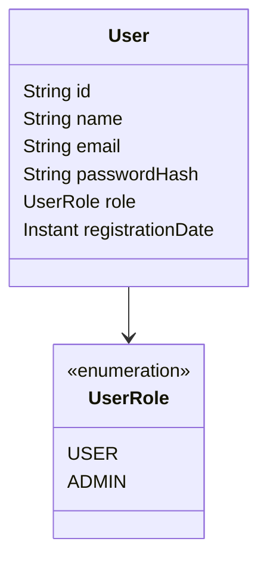

# Modelagem de Usuário e Autenticação

Este documento define como o TCG Market representa um usuário e qual estratégia de autenticação e autorização a aplicação vai usar. O cadastro público já está implementado. Login, emissão de token e proteção de endpoints continuam para as tarefas seguintes.

## Princípio

O usuário é um documento da coleção `users` no MongoDB. Não há banco relacional, JPA nem SQL.

A arquitetura continua MVC na API: o controller recebe a requisição, o service aplica a regra e o repository persiste ou consulta o documento. O React não acessa o MongoDB.

## Modelo `User`

Coleção: `users`.

| Campo | Tipo no Java | No MongoDB | Regra |
| --- | --- | --- | --- |
| `id` | `String` | `ObjectId` | Gerado pelo MongoDB. O Spring Data mapeia o `ObjectId` para `String`. |
| `name` | `String` | `String` | Nome informado no cadastro. |
| `email` | `String` | `String` | Identificador de login. Índice único. Gravado em minúsculas, sem espaços nas pontas. |
| `passwordHash` | `String` | `String` | Hash BCrypt. Nunca a senha em texto puro. Nunca devolvido pela API. |
| `role` | `UserRole` | `String` | Definido pela aplicação. O cliente não escolhe o perfil. |
| `registrationDate` | `Instant` | `Date` | Preenchido pelo servidor, em UTC, no momento da persistência. |

O e-mail único está declarado com `@Indexed(unique = true)`. A aplicação cria esse índice porque `spring.data.mongodb.auto-index-creation` está habilitado. A comparação de duplicidade usa o valor já normalizado: `Joao@Email.com` e `joao@email.com` são o mesmo e-mail.

`passwordHash` existe para deixar explícito que o campo persistido é o hash. A senha em claro só atravessa a requisição de cadastro ou de login e é descartada depois do BCrypt.

## Perfis

| Perfil | Quem recebe | O que poderá fazer |
| --- | --- | --- |
| `USER` | Todo cadastro público | Operar a própria conta: anúncios, compras, trocas, carrinho, coleção e perfil. |
| `ADMIN` | Atribuição interna, nunca pelo formulário público | Moderar anúncios e gerenciar usuários (RF18). |

Um documento novo nasce com `role = USER`. Promover alguém a `ADMIN` será uma operação administrativa, numa tarefa própria.

## Autenticação

A estratégia é **JWT stateless com Spring Security**.

- A senha é conferida com BCrypt contra `passwordHash`.
- O login bem-sucedido devolve um token assinado. O token carrega o `id` do usuário e o `role`.
- As requisições seguintes enviam `Authorization: Bearer <token>`.
- O backend valida o token e coloca o usuário no contexto de segurança. As operações leem essa identidade. O corpo da requisição não informa quem é o usuário nem qual é o perfil.
- O MongoDB não guarda sessão. O token é a prova da autenticação até expirar.

Essa escolha acompanha o que o projeto já é: API REST e frontend React em outra origem. O Axios em `frontend/src/services/api.ts` passa a enviar o header quando o login existir. O CORS atual já libera o header.

O `spring-boot-starter-security` entra na tarefa de login, junto com o filtro do token. Incluir o starter agora, sem essa configuração, fecharia os endpoints atuais atrás do login padrão do Spring Security. O cadastro já grava o hash com `BCryptPasswordEncoder`, pela dependência `spring-security-crypto`, sem ativar o filtro de segurança.

## Cadastro público

`POST /api/users` recebe somente `name`, `email` e `password`. O corpo não tem `role`. Se o cliente enviar `role`, o campo é ignorado.

A senha precisa ter no mínimo 6 caracteres e no máximo 72 bytes em UTF-8, com letra maiúscula, número e caractere especial. Letra minúscula não é obrigatória.

A aplicação normaliza o e-mail, recusa duplicidade, grava o hash em `passwordHash`, fixa `role = USER` e preenche `registrationDate` em UTC. A resposta traz `id`, `name`, `email`, `role` e `registrationDate`. `password` e `passwordHash` não saem na resposta.

E-mail já cadastrado responde `409`. Dados inválidos respondem `400`.

## Autorização

A autorização é por perfil, lido do token e conferido no backend.

| Acesso | Exemplos previstos |
| --- | --- |
| Público | `GET /api/health`, cadastro e login |
| Autenticado (`USER` ou `ADMIN`) | Perfil, anúncios, carrinho, trocas e coleção do próprio usuário |
| Somente `ADMIN` | Moderação e gestão de usuários |

Uma conta `USER` só altera dados ligados ao próprio `id`. O `id` vem do token, não de um campo enviado pelo cliente.

## O que esta etapa entrega

- `com.pitcc.model.User`
- `com.pitcc.model.UserRole`
- `com.pitcc.repository.UserRepository`, com `findByEmail` e `existsByEmail`
- Índice único de e-mail, criado automaticamente na subida da aplicação
- `POST /api/users`, com validação, hash e perfil `USER`

## O que fica para as próximas tarefas

1. Login: conferir o hash e emitir o JWT.
2. Filtro de autenticação e contexto do usuário autenticado.
3. Proteção dos endpoints.
4. Autorização por `USER` e `ADMIN`.
5. Uso do `id` autenticado nas operações de negócio.
