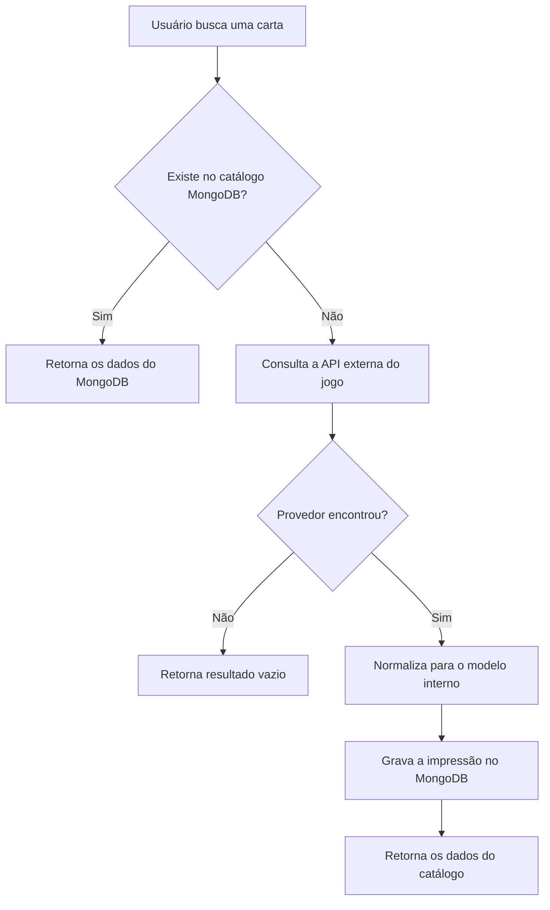

# Arquitetura do Catálogo de Cartas

Este documento define como o TCG Market obtém, guarda e consulta os dados de cartas. Ele descreve a arquitetura planejada. Nesta etapa só a integração com as APIs externas está implementada. A persistência no MongoDB, a busca local e a importação são tarefas seguintes.

## Princípio

**O MongoDB é a fonte principal do catálogo da aplicação.**

Pokémon TCG API, YGOPRODeck e Scryfall não são consultadas a cada busca de usuário. Elas servem para descobrir e importar cartas que ainda não existem no catálogo local. Depois de importada, a carta é lida do MongoDB.

## As três camadas de dados

### Fonte externa de catálogo

| Jogo | API | Uso |
| --- | --- | --- |
| Pokémon | Pokémon TCG API (`api.pokemontcg.io/v2`) | Descobrir cartas Pokémon ainda não importadas |
| Yu-Gi-Oh! | YGOPRODeck (`db.ygoprodeck.com/api/v7`) | Descobrir cartas Yu-Gi-Oh! ainda não importadas |
| Magic: The Gathering | Scryfall (`api.scryfall.com`) | Descobrir cartas Magic ainda não importadas |

Essas APIs fornecem dados de catálogo: nome, coleção, número, raridade e imagem. Não são a fonte de verdade da aplicação durante a leitura.

### Catálogo interno (MongoDB)

Contém as cartas e impressões já importadas e normalizadas pelo TCG Market. É daqui que a aplicação lê o catálogo.

Cada registro representa **uma impressão específica** de uma carta, não a carta conceitual. Exemplo: o Blue-Eyes White Dragon de *Legend of Blue Eyes White Dragon* e o de *Starter Deck: Kaiba* são dois registros diferentes, ligados pelo mesmo id conceitual.

### Dados de usuário e de negócio

Também são guardados pelo TCG Market e **não vêm das APIs externas**:

- coleção do usuário (quais impressões ele possui);
- quantidade;
- estado de conservação;
- situação de venda ou troca;
- preços definidos no marketplace;
- dados do vendedor;
- transações e histórico;
- metadados próprios da plataforma.

Esses dados referenciam uma impressão do catálogo interno. Nunca referenciam um DTO de API externa.

## Fluxo de consulta planejado



1. O usuário busca uma carta.
2. O TCG Market procura primeiro no catálogo MongoDB.
3. Se já existem cartas correspondentes, devolve os dados locais sem chamar provedor externo.
4. Se não encontra localmente, consulta a API externa do jogo.
5. Se o provedor encontra a carta, os dados são normalizados para o modelo interno.
6. A impressão normalizada é gravada no MongoDB.
7. O resultado é devolvido para a aplicação.
8. Buscas futuras pela mesma carta usam o MongoDB sempre que possível.

## Consequências para as limitações das APIs externas

Como o catálogo é persistido, as limitações das APIs pesam menos do que num sistema que consulta o provedor a cada busca.

- **Limite de requisições:** afeta só buscas que não acham a carta no MongoDB e a importação. A Scryfall limita `/cards/search` a 2 requisições por segundo. Isso importa para importações em lote, não para a leitura de cartas já importadas.
- **Indisponibilidade temporária:** uma queda da API externa não torna indisponíveis as cartas já importadas. Só impede a descoberta de cartas novas enquanto durar.
- **Instabilidade da Pokémon TCG API:** no smoke test real, a API alternou entre HTTP 200, 500 e 502 para a mesma requisição. Isso não afeta cartas Pokémon já persistidas.
- **Risco de descontinuação da Pokémon TCG API:** atinge a descoberta e a importação futura de cartas Pokémon. Os registros já gravados no MongoDB continuam válidos. Trocar de provedor exige uma nova integração, não uma migração do catálogo existente.
- **Latência externa:** relevante principalmente quando a carta não está no catálogo local.
- **Requisições repetidas:** buscar de novo, no provedor, cartas já conhecidas deve ser evitado. A leitura normal vem do MongoDB.
- **Fonte de verdade:** os provedores externos não são a fonte de verdade de cada leitura. Uma atualização vinda do provedor (nova impressão, imagem corrigida) só chega ao catálogo por importação ou atualização explícita.

## Isolamento dos modelos

Os DTOs de cada API ficam restritos à camada de integração e nunca são persistidos nem expostos à aplicação.

```text
API externa → DTO do provedor → mapper → ExternalCard → (futuro) documento MongoDB
```

- `PokemonCardDto`, `YugiohCardDto` e `MtgCardDto` só existem dentro dos pacotes de cada provedor.
- `ExternalCard` é a representação normalizada que sai da integração.
- O documento MongoDB do catálogo interno será definido numa tarefa própria, a partir de `ExternalCard`, sem depender do formato de nenhuma API.

## Identidade das impressões

`ExternalCard` separa a carta conceitual da impressão:

- `externalId`: identifica a impressão no provedor. Será a chave para deduplicar a importação no MongoDB, junto com o jogo.
- `conceptualId`: identifica a carta conceitual quando o provedor oferece esse id; caso contrário, fica `null`.

| Jogo | `externalId` (impressão) | `conceptualId` (carta conceitual) |
| --- | --- | --- |
| Pokémon | id da API, ex.: `base1-4` | `null`: a API não tem id conceitual separado |
| Yu-Gi-Oh! | `passcode:set_code:set_rarity`, ex.: `89631139:LOB-EN001:Ultra Rare` | passcode, ex.: `89631139` |
| Magic | UUID da Scryfall | `oracle_id` |

No Yu-Gi-Oh!, a raridade faz parte do id porque o mesmo `set_code` aparece em várias raridades para um passcode. Exemplo confirmado na API real: `RA01-EN008` de Ash Blossom em sete raridades.

## O que está implementado e o que falta

### Implementado

- Clients HTTP para as três APIs, com `RestClient` do Spring.
- DTOs por provedor e mappers para `ExternalCard`.
- Contrato comum `CardCatalogProvider`, com `searchCards` e `findByExternalId`.
- Tratamento de falhas externas com `ExternalApiException`.
- Configuração das URLs e da chave da Pokémon TCG API por variável de ambiente.

Código em `backend/src/main/java/com/pitcc/integration/catalog/`.

### Próximas tarefas

- Documento e repositório MongoDB do catálogo interno.
- Serviço de consulta que busca primeiro no MongoDB e usa o provedor como fallback.
- Importação e gravação das impressões normalizadas, deduplicadas por jogo e `externalId`.
- Política de atualização de cartas já importadas.
- Coleção, anúncios, trocas e transações referenciando impressões do catálogo interno.
