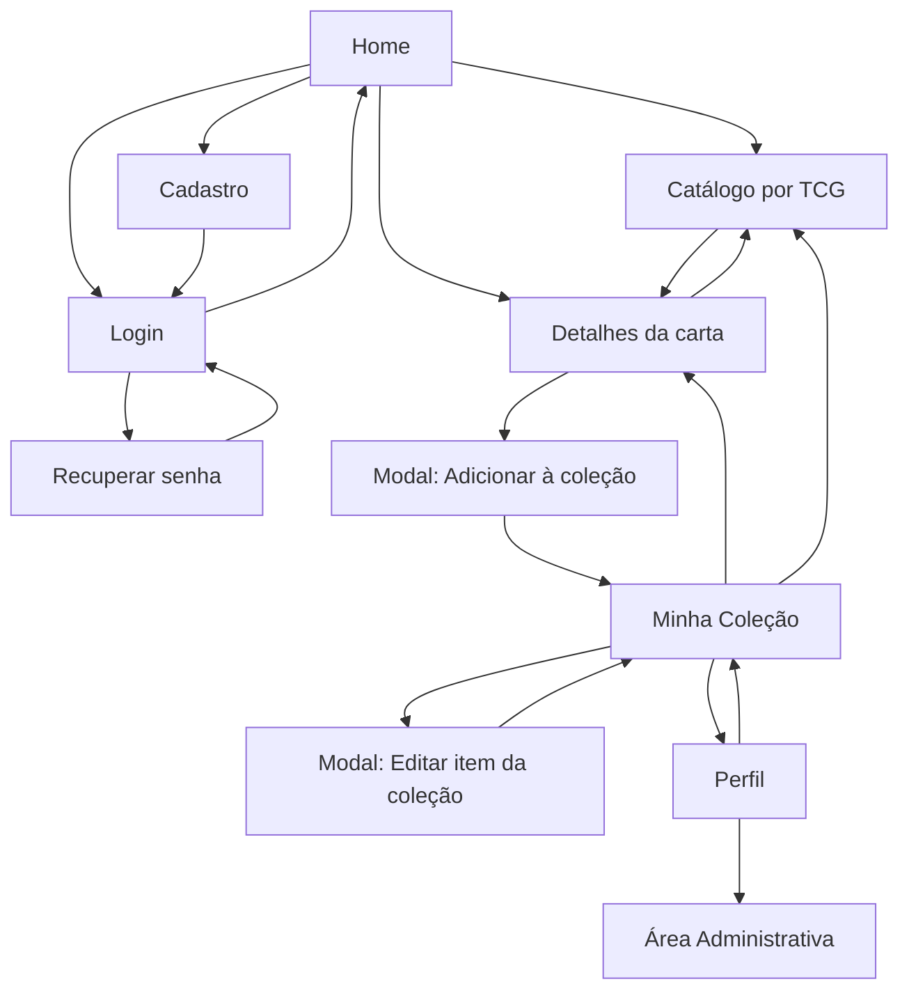
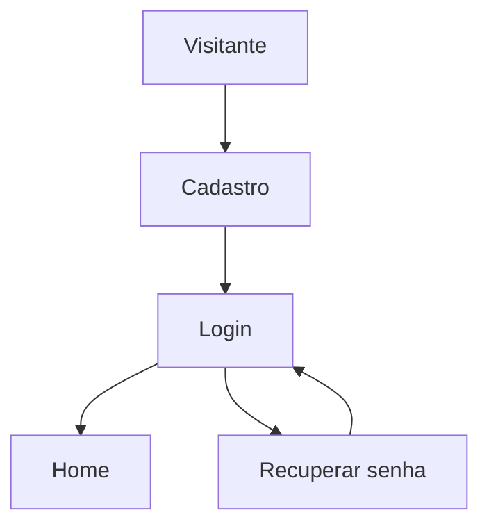
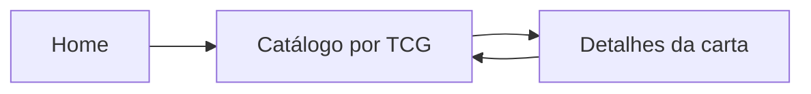
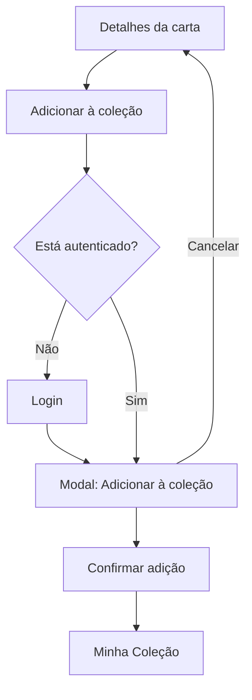
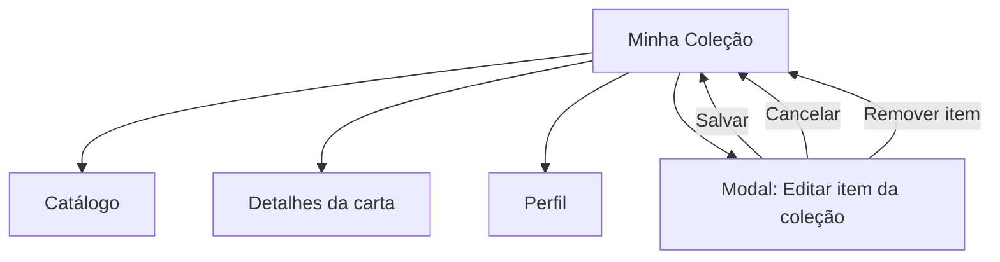
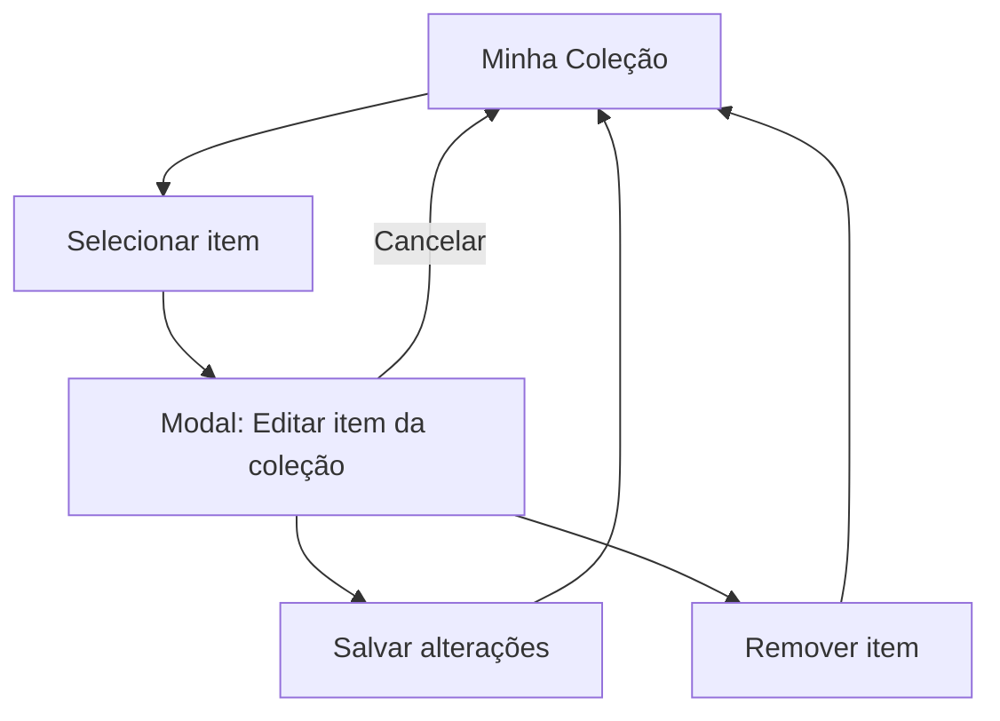
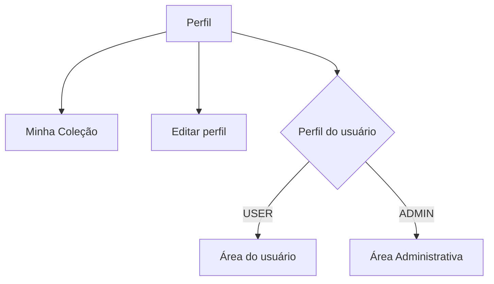
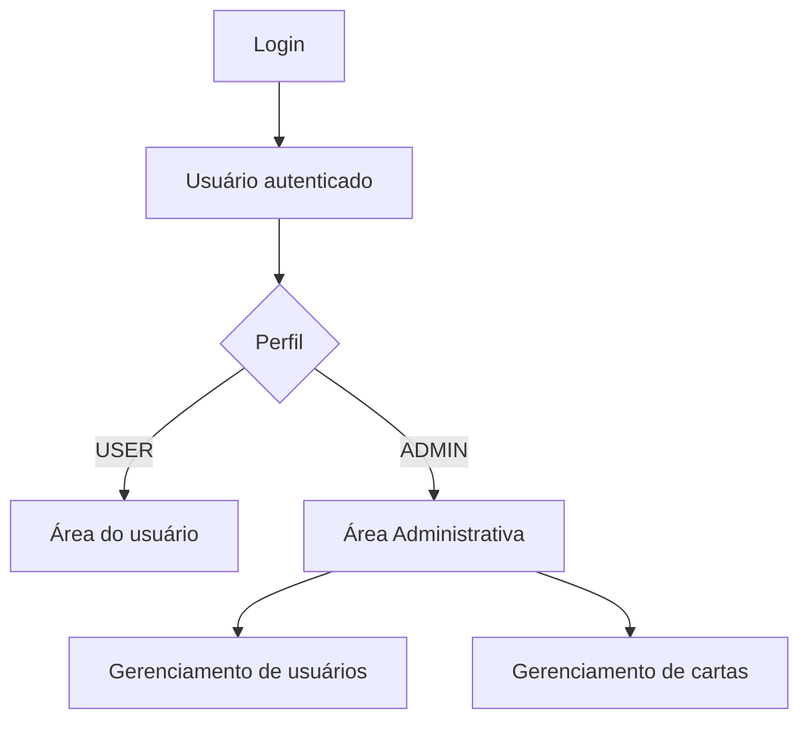
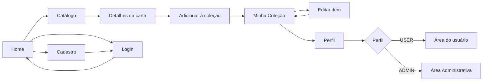

# TCG Market — Estrutura de Navegação

> Estrutura de navegação da Milestone 1, utilizada como base para a criação dos wireframes, protótipos e, posteriormente, implementação das rotas e telas do Front-end.

---

## 1. Objetivo

Definir como os usuários navegarão pelo TCG Market e quais áreas estarão disponíveis de acordo com o estado de autenticação e o perfil do usuário.

A estrutura contempla:

- Autenticação;
- Home;
- Catálogo de cartas;
- Detalhes da carta;
- Minha Coleção;
- Adicionar carta à coleção;
- Editar item da coleção;
- Perfil do usuário;
- Área administrativa;
- Usuários autenticados e não autenticados;
- Diferenciação entre `USER` e `ADMIN`.

---

# 2. Mapa de Navegação



> **Observação:** o acesso à Área Administrativa é restrito ao perfil `ADMIN`.

> **Observação:** “Adicionar carta à coleção” e “Editar item da coleção” são estados apresentados em modal sobre suas respectivas telas de origem. Portanto, não representam páginas independentes da aplicação.

---

# 3. Estados de Autenticação

A aplicação possui dois estados principais de navegação.

## 3.1 Usuário não autenticado

O visitante pode acessar as áreas públicas da aplicação.

### Acessos

- Home;
- Catálogo;
- Detalhes da carta;
- Login;
- Cadastro;
- Recuperação de senha.

### Ações que exigem autenticação

Funcionalidades pessoais, como adicionar uma carta à coleção, exigem autenticação.

Caso o visitante tente executar uma ação restrita, deverá ser direcionado para o Login.

Exemplo:

```text
Visitante
   ↓
Detalhes da carta
   ↓
Adicionar à coleção
   ↓
Login
   ↓
Autenticação
   ↓
Retorno à ação solicitada
   ↓
Modal: Adicionar à coleção
```

O objetivo é preservar a intenção do usuário após a autenticação sempre que possível.

---

## 3.2 Usuário autenticado

Após realizar o login, o usuário passa a ter acesso às funcionalidades relacionadas à sua conta.

```text
Usuário autenticado
        │
        ├── Home
        ├── Catálogo
        ├── Detalhes da carta
        ├── Minha Coleção
        │      ├── Adicionar carta
        │      └── Editar item
        └── Perfil
```

---

# 4. Diferenciação entre USER e ADMIN

Os dois perfis possuem acesso às funcionalidades comuns do sistema. Entretanto, o `ADMIN` possui acesso adicional à Área Administrativa.

## USER

```text
USER
├── Home
├── Catálogo
├── Detalhes da carta
├── Minha Coleção
│   ├── Adicionar carta
│   └── Editar item
└── Perfil
```

## ADMIN

```text
ADMIN
├── Home
├── Catálogo
├── Detalhes da carta
├── Minha Coleção
│   ├── Adicionar carta
│   └── Editar item
├── Perfil
└── Área Administrativa
```

A Área Administrativa não deve ser disponibilizada para usuários com perfil `USER`.

---

# 5. Controle de Acesso

| Área / Funcionalidade | Visitante | USER | ADMIN |
|---|:---:|:---:|:---:|
| Home | ✅ | ✅ | ✅ |
| Catálogo | ✅ | ✅ | ✅ |
| Detalhes da carta | ✅ | ✅ | ✅ |
| Login | ✅ | ↪️ Home | ↪️ Home |
| Cadastro | ✅ | ↪️ Home | ↪️ Home |
| Recuperar senha | ✅ | ↪️ Home | ↪️ Home |
| Minha Coleção | ❌ → Login | ✅ | ✅ |
| Adicionar à coleção | ❌ → Login | ✅ | ✅ |
| Editar item da coleção | ❌ → Login | ✅ | ✅ |
| Perfil | ❌ → Login | ✅ | ✅ |
| Área Administrativa | ❌ → Login | ❌ → 403 | ✅ |

### Legenda

- ✅ Acesso permitido;
- ❌ Acesso negado;
- `→ Login`: usuário precisa estar autenticado;
- `→ 403`: usuário autenticado, porém sem permissão;
- `↪️ Home`: usuário já autenticado não precisa acessar novamente o fluxo de autenticação.

---

# 6. Rotas da Aplicação

As rotas abaixo representam a estrutura de navegação planejada para a Milestone 1.

| Rota | Tela/Área | Acesso |
|---|---|---|
| `/` | Home | Público |
| `/login` | Login | Público |
| `/cadastro` | Cadastro | Público |
| `/recuperar-senha` | Recuperar senha | Público |
| `/catalogo/:tcg` | Catálogo por TCG | Público |
| `/cartas/:id` | Detalhes da carta | Público |
| `/minha-colecao` | Minha Coleção | USER / ADMIN |
| `/perfil` | Perfil | USER / ADMIN |
| `/admin` | Área Administrativa | ADMIN |

## 6.1 Estados sem rota própria

| Estado | Origem | Acesso |
|---|---|---|
| Modal — Adicionar carta à coleção | Catálogo / Detalhes da carta | USER / ADMIN |
| Modal — Editar item da coleção | Minha Coleção | USER / ADMIN |

Os modais fazem parte do fluxo das telas de origem e não necessitam, inicialmente, de rotas próprias.

Caso a implementação futura exija URLs compartilháveis ou acesso direto a essas operações, essa decisão poderá ser revisada.

> As rotas representam a estrutura planejada e poderão ser ajustadas durante a implementação do Front-end.

---

# 7. Fluxos Principais

## F1 — Cadastro e Login



### Fluxo

1. O visitante acessa a aplicação;
2. Pode realizar o cadastro;
3. Após o cadastro, realiza o login;
4. Após a autenticação, é direcionado para a Home;
5. Caso esqueça a senha, poderá acessar a recuperação de senha.

---

## F2 — Catálogo e Detalhes da Carta



### Fluxo

1. O usuário acessa o catálogo;
2. Escolhe um TCG;
3. Visualiza as cartas disponíveis;
4. Pode utilizar busca, filtros e ordenação;
5. Seleciona uma carta;
6. A aplicação apresenta os detalhes da carta;
7. O usuário pode retornar ao catálogo.

Os diferentes TCGs utilizam a mesma estrutura de catálogo, alterando o conteúdo apresentado de acordo com o TCG selecionado.

---

## F3 — Adicionar Carta à Coleção



### Fluxo

1. O usuário acessa uma carta através do Catálogo ou da tela de Detalhes;
2. Seleciona a opção **Adicionar à coleção**;
3. Caso não esteja autenticado, é direcionado para o Login;
4. Após a autenticação, o sistema retoma a ação solicitada;
5. O modal **Adicionar carta à coleção** é apresentado;
6. O usuário informa os dados referentes à sua posse da carta;
7. Confirma a inclusão;
8. O item passa a fazer parte de **Minha Coleção**.

### Informações da coleção

O modal pode conter informações como:

- Quantidade;
- Condição;
- Idioma;
- Observações;
- Favorito.

A carta utilizada como referência continua sendo a carta existente no catálogo, evitando duplicação dos dados globais da carta.

---

## F4 — Minha Coleção



### Fluxo

Na **Minha Coleção**, o usuário poderá:

- Visualizar suas cartas;
- Buscar e filtrar itens do próprio acervo;
- Acessar os detalhes de uma carta;
- Adicionar novas cartas;
- Selecionar um item para edição;
- Alterar informações referentes à posse;
- Marcar ou desmarcar itens como favoritos;
- Remover itens da coleção.

A tela de Minha Coleção possui finalidade diferente do Catálogo:

> **Catálogo:** descoberta e consulta das cartas disponíveis no sistema.

> **Minha Coleção:** visualização e gerenciamento das cartas pertencentes ao usuário.

---

## F5 — Editar Item da Coleção



### Fluxo

1. O usuário acessa **Minha Coleção**;
2. Seleciona uma carta pertencente ao seu acervo;
3. Escolhe a opção de edição;
4. O modal **Editar item da coleção** é apresentado;
5. O usuário pode alterar as informações relacionadas à sua posse;
6. Ao salvar, as alterações são refletidas na coleção;
7. O usuário também pode cancelar a operação ou remover o item.

---

## F6 — Perfil do Usuário



### Fluxo

O Perfil concentra informações e atalhos relacionados ao usuário.

Pode apresentar:

- Informações do usuário;
- Resumo da coleção;
- Favoritos;
- Reputação;
- Atividade;
- Atalhos para funcionalidades pessoais;
- Acesso à edição do perfil.

Para usuários `ADMIN`, o acesso à Área Administrativa também poderá ser disponibilizado através do Perfil ou menu do usuário.

---

## F7 — Área Administrativa



### Fluxo

1. O administrador realiza o login;
2. O sistema identifica seu perfil como `ADMIN`;
3. A Área Administrativa fica disponível;
4. O administrador pode acessar as funcionalidades administrativas previstas para a Milestone 1.

Caso um `USER` tente acessar diretamente uma área administrativa:

```text
USER
 ↓
/admin
 ↓
403 — Acesso negado
```

---

# 8. Telas da Milestone 1

## 8.1 Telas principais

| # | Tela | Área | Acesso | Situação |
|---:|---|---|---|---|
| 1 | Home | Público | Todos | Protótipo existente |
| 2 | Login | Autenticação | Visitante | Protótipo existente |
| 3 | Cadastro | Autenticação | Visitante | Protótipo existente |
| 4 | Catálogo por TCG | Catálogo | Todos | Protótipo existente |
| 5 | Detalhes da carta | Catálogo | Todos | Protótipo existente |
| 6 | Minha Coleção | Coleção | USER / ADMIN | Protótipo existente |
| 7 | Perfil | Perfil | USER / ADMIN | Protótipo existente |
| 8 | Área Administrativa | Administração | ADMIN | Protótipo existente |

## 8.2 Estados/Modais

| # | Estado | Origem | Acesso | Situação |
|---:|---|---|---|---|
| 9 | Adicionar carta à coleção | Catálogo / Detalhes | USER / ADMIN | Protótipo existente |
| 10 | Editar item da coleção | Minha Coleção | USER / ADMIN | Protótipo existente |

## 8.3 Telas/Estados Complementares a Validar

| Tela/Estado | Motivo |
|---|---|
| Recuperar senha | Acesso através do Login |
| Editar perfil | Ação disponível através do Perfil |
| Favoritos | Funcionalidade relacionada ao usuário |
| Gerenciamento de usuários | Área administrativa |
| Gerenciamento de cartas | Área administrativa |
| 403 — Acesso negado | Controle de autorização |
| 404 — Página não encontrada | Tratamento de rotas inexistentes |
| Termos de uso | Referenciado durante o Cadastro |
| Política de privacidade | Referenciada durante o Cadastro e/ou Footer |

> Os itens complementares devem ser validados pelo time para determinar quais pertencem efetivamente à Milestone 1.

---

# 9. Navegação Global

O sistema deverá possuir uma navegação global compartilhada entre as principais telas.

A navegação deve refletir tanto o estado de autenticação quanto o perfil do usuário.

## 9.1 Navegação principal

A estrutura definida para as principais telas utiliza duas camadas.

### Primeira camada

```text
[ LOGO ]   [ PESQUISA ]              [ AÇÕES / LOGIN / PERFIL ]
```

Responsável por:

- Identidade do TCG Market;
- Pesquisa;
- Ações relacionadas ao usuário;
- Login ou Perfil.

### Segunda camada

```text
Início | Magic | Pokémon | Yu-Gi-Oh! | One Piece | Digimon
```

Responsável pela navegação entre a Home e os diferentes catálogos de TCG.

---

## 9.2 Visitante

```text
TCG Market
├── Home
├── Pesquisa
├── Magic
├── Pokémon
├── Yu-Gi-Oh!
├── One Piece
├── Digimon
├── Entrar
└── Criar conta
```

---

## 9.3 USER

```text
TCG Market
├── Home
├── Pesquisa
├── Magic
├── Pokémon
├── Yu-Gi-Oh!
├── One Piece
├── Digimon
└── Menu do usuário
    ├── Perfil
    └── Minha Coleção
```

---

## 9.4 ADMIN

```text
TCG Market
├── Home
├── Pesquisa
├── Magic
├── Pokémon
├── Yu-Gi-Oh!
├── One Piece
├── Digimon
└── Menu do usuário
    ├── Perfil
    ├── Minha Coleção
    └── Área Administrativa
```

A opção **Área Administrativa** deve ser apresentada somente quando o usuário possuir permissão `ADMIN`.

---

# 10. Fluxo Geral da Milestone 1



O fluxo geral evidencia a separação entre:

- Navegação pública;
- Autenticação;
- Catálogo global;
- Funcionalidades pessoais;
- Gerenciamento da coleção;
- Perfil;
- Funcionalidades administrativas.

---

# 11. Áreas Restritas

## Requer autenticação

As seguintes áreas e funcionalidades exigem autenticação:

- Minha Coleção;
- Adicionar carta à coleção;
- Editar item da coleção;
- Perfil.

Usuários não autenticados devem ser direcionados ao Login quando tentarem executar essas ações.

## Requer perfil ADMIN

A seguinte área exige autorização administrativa:

- Área Administrativa.

Um usuário autenticado como `USER` não deve conseguir acessar `/admin`.

O sistema deverá retornar ou apresentar o estado:

**403 — Acesso negado.**

---

# 12. Pontos em Aberto

Algumas funcionalidades aparecem nos protótipos ou requisitos relacionados ao projeto, mas precisam ser confirmadas quanto à participação na Milestone 1.

- Favoritos;
- Recuperação de senha;
- Edição de perfil;
- Gerenciamento de usuários;
- Gerenciamento de cartas pelo administrador;
- Notificações;
- Criação de anúncios;
- Compras e vendas;
- Carrinho;
- Outras funcionalidades de Marketplace.

Esses itens devem ser classificados pelo time como:

- **Milestone 1**;
- **Próxima milestone**;
- **Fora do escopo atual**.

> A presença visual de uma funcionalidade nos protótipos não determina automaticamente sua inclusão no escopo da Milestone 1.

---

# 13. Critérios de Aceite

- [x] O fluxo de autenticação está representado;
- [x] O fluxo entre catálogo, detalhes e coleção está representado;
- [x] O fluxo de adição de carta à coleção está representado;
- [x] O fluxo de edição de item da coleção está representado;
- [x] A área administrativa está contemplada;
- [x] A diferença de acesso entre `USER` e `ADMIN` está definida;
- [x] Os estados autenticado e não autenticado estão definidos;
- [x] As principais telas necessárias para a Milestone 1 foram identificadas;
- [x] As áreas restritas foram identificadas;
- [x] As rotas planejadas foram documentadas;
- [x] Os principais fluxos de navegação foram documentados;
- [x] Os estados apresentados através de modal foram identificados;
- [x] Os pontos que ainda precisam de decisão do time estão identificados.

---

# 14. Resultado Esperado

Esta documentação deverá servir como referência para as próximas etapas da Milestone 1:

```text
Estrutura de navegação
        ↓
Wireframes
        ↓
Protótipos
        ↓
Definição das rotas
        ↓
Implementação Front-end
```

A estrutura poderá ser atualizada conforme novas decisões forem tomadas pelo time durante o desenvolvimento.

---

## Resumo da Estrutura

```text
TCG MARKET
│
├── ÁREA PÚBLICA
│   ├── Home
│   ├── Catálogo por TCG
│   │   └── Detalhes da carta
│   └── Autenticação
│       ├── Login
│       ├── Cadastro
│       └── Recuperar senha
│
├── ÁREA AUTENTICADA — USER / ADMIN
│   ├── Minha Coleção
│   │   ├── Adicionar carta [Modal]
│   │   └── Editar item [Modal]
│   └── Perfil
│
└── ÁREA RESTRITA — ADMIN
    └── Área Administrativa
```

**Versão:** V1  
**Escopo:** Milestone 1  
**Status:** Estrutura de navegação definida
